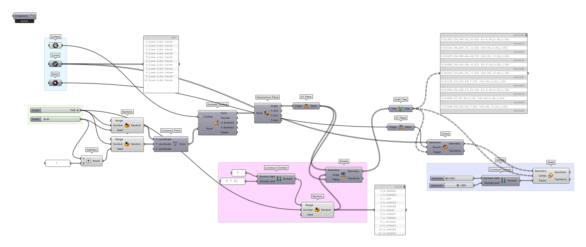
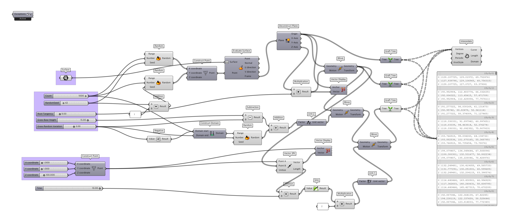
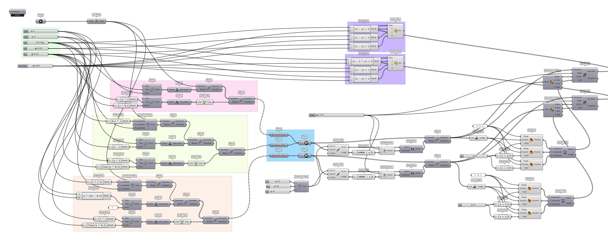

# Computational Design Works

 
 

### **Landscape with Random Vegetation**

https://github.com/1ncarnati0n/RhinoGrasshopperPython/assets/84266929/7394ce48-e82b-4648-a347-02690e0c31bb

 

### **Wind-swept Grass Pathch**

https://github.com/1ncarnati0n/RhinoGrasshopperPython/assets/84266929/b0c5a578-a250-4a95-8c0e-276c23aae39e

 

### **Exploding Brick Wall**

 